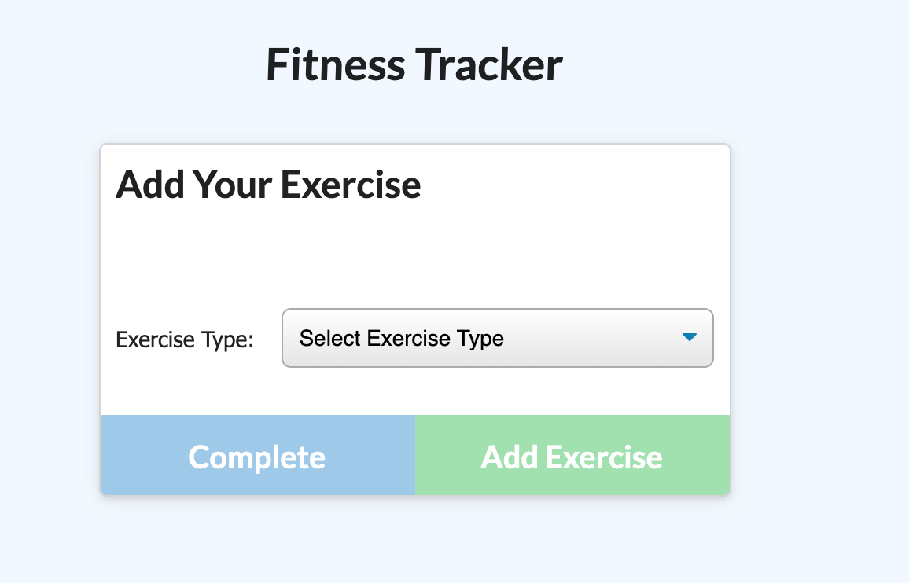

<br>
<u>

<center>


# Fitness Tracker 

</u>

<u>

## Goal: 

</u>
</center>

### The goal for this assignment was to create a fitness tracker. We were provided with the front end code and were required to use a MongoDB database, Mongoose schema, and handle routes with Express.

<br>


## Criteria:

Within this project, I included:

<center>

```
1. MongoDB database
2. Resume, Linkedin, Github and Email
3. Mongoose schema
4. Functional tracker app

 ```

</center>


<br>




<u>

<br>

## Technologies Used:

- Visual Studio Code
- Gitlab
- Terminal
- Github

<br>

## Table of Contents:
1. Goal
2. Criteria
3. Issues
4. Technologies Used
5. Table of Contents
6. Links
7. Deployed Link


<br>

## Links:

- [Link to Github](https://github.com/kellystone4/fitnessTracker)
- [Link to LinkedIn](https://www.linkedin.com/in/kelly-a-stone/)

<br>

## Deployed Link:

- [Link to Heroku Site](https://guarded-sands-28138.herokuapp.com/)
